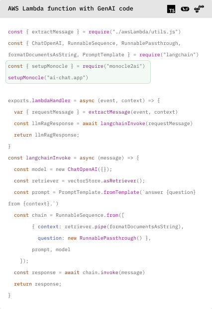
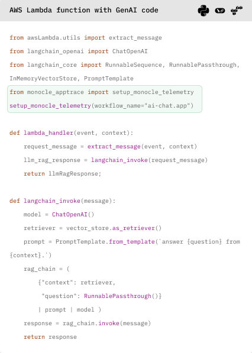

# Observing GenAI apps with open-source Monocle

This repository contains source code for an [AI assistant](#about-this-ai-assistant) that answers questions about coffee to demo how you can use open-source [Monocle](#about-monocle) to make observing and improving GenAI apps easy.  

 

[Ask a question](https://monocle2ai.okahu.io) about coffee and this AI assistant will answer based on [knowledgebase](lambda/monocle-s3-langchain/coffee-chatbot-typescript/data/coffeeText.js) about coffee using an LLM. You can then explore telemetry to view the traces captured by Monocle resulting from this interaction. It's easy to instrument your GenAI code with Monocle as shown in the code block. 

### About Monocle 

[Monocle](http://monocle2ai.org/) is a GenAI-native community driven open source project created to simplify instrumentation of AI apps so app developers can built high impact, safe and reliable AI apps. 

Monocle is currently a [Sandbox](https://lfaidata.foundation/projects/monocle/) project in Linux Foundation AI & Data. In it's first iteration, Monocle helps app developers make GenAI apps observable without having to write last-mile monitoring code. 

  

### About this AI assistant

This AI assistant is a simple chatbot with the front-end built with Next.js and the GenAI code built with Langchain framework that relies on an OpenAI GPT model. The app is hosted in AWS with the GenAI code served as Lambda function that calls OpenAI for model inference. 

The GenAI app code is instrumented with Monocle using one line of code to trace the entire conversation including inferences to OpenAI and vector searchs. Monocle is configured to send traces to S3 so you can explore the raw trace data, which is in an OpenTelemetry compatible format with a GenAI-native metamodel abstraction added to it to simplify analysis. 

This repository includes two versions of the app where the GenAI code is built in TypeScript or Python. We also have versions of this code built with other frameworks like LlamaIndex and hosted on other clouds like Microsoft Azure. Monocle works identically irrespective of how your GenAI app is coded or where it's hosted. 

## Play with this AI assistant

- Open a chat window and ask this AI assistant a question about coffee  
  - [Ask a question](https://monocle2ai.okahu.io) 
- Check out the traces generated by Monocle 
  - Click on the [View Telemetry](https://monocle2ai.okahu.io/s3) button to see a list of trace files on S3. 
  - Click on a specific trace file to see the content in a modal view. You can expand or collapse sections of json. 

## Explore the GenAI code 

- Front end of this chatbot is built using Next.js and runs in AWS App Runner.   
  - Start with [page.tsx](src/app/page.tsx) for the code of the main chat window. 
  - Entering a message and clicking send invokes a Lambda function in [api/coffeechat](src/app/api/coffeechat/route.ts).

- GenAI code is built using LangChain framework and runs in an AWS Lambda function.
  - See [coffee-chatbot-typescript](lambda/monocle-s3-langchain/coffee-chatbot-typescript/) for the TypeScript version.
      - Entry point is [app.js](lambda/monocle-s3-langchain/coffee-chatbot-typescript/app.js) which handles the payload sent from the front-end.
      - From this entry point, **a single RAG chain** is invoked as specified in [langchain.js](lambda/monocle-s3-langchain/coffee-chatbot-typescript/langchain.js). 
      - In this example,
            - A list of Coffee preparations is used to define the [knowledge base](lambda/monocle-s3-langchain/coffee-chatbot-typescript/data/coffeeText.js).  
            - Embeddings are generated using an OpenAI embedding model, stored in an in-memory vector store and used to create context for language model. 
            - A prompt template is included as part of the Langchain code and used with user input and context to generate a response to the user with the language model. 
            - OpenAI is also used for the language model. 
      - See [utils.js](lambda/monocle-s3-langchain/coffee-chatbot-typescript/utils.js) for the implementation of `langchainInvoke()`. 
  - See [coffee-chatbot-python](lambda/python-monocle-s3-langchain/coffee-chatbot-python/) for the Python version.

- Monocle instrumentation is added to the entry point of the Lambda function in [app.js](lambda/monocle-s3-langchain/coffee-chatbot-typescript/app.js). 
  - Monocle will trace execution of any GenAI-native code, e.g. `langchainInvoke(requestMessage)`. 
  - For TypeScript, see [app.js](lambda/monocle-s3-langchain/coffee-chatbot-typescript/app.js). 
     - `const { setupMonocle } = require("monocle2ai")` specifies use of the Monocle npm package. 
     - `setupMonocle("openai.app")` specifies how Monocle package should start the trace and add reousrce attribute in the trace. 
  - See [package.json](lambda/monocle-s3-langchain/coffee-chatbot-typescript/package.json) for the Monocle dependency `"monocle2ai": "^0.0.1-beta.2"`
  - See [template.yaml](lambda/monocle-s3-langchain/template.yaml) for environment variables to configure where Monocle sends the traces.
     - In this example the traces are sent to a bucket in AWS S3. 

- For demo purposes, this example also includes features to [browse](src/app/api/s3list/route.ts) and [view](src/app/s3/page.tsx) Monocle generated traces stored in AWS S3. 

## Deploy this app in your cloud

1. Deploy the GenAI code to AWS Lambda
  - Use AWS SAM client to deploy Lambda function - [TypeScript](lambda/monocle-s3-langchain/README.md) or [Python](lambda/python-monocle-s3-langchain/README.md)
  - Required environmental variables
    - `OPENAI_API_KEY` - for chatbot to make call to OpenAI for embedding and language model.
    - `MONOCLE_EXPORTER` - select `s3` to use the S3 exporter. Other options include blob, okahu and more to come soon. 
    - `MONOCLE_S3_BUCKET_NAME` - S3 bucket for monocle to write traces to 
    - `MONOCLE_AWS_ACCESS_KEY_ID` and `MONOCLE_AWS_SECRET_ACCESS_KEY` - credentials for monocle to write traces to S3 bucket
    - `MONOCLE_S3_KEY_PREFIX` - any prefix added to trace file name for this specific app. Used when storing traces from multiple apps in a single bucket.
  - Get Lambda function name for use in step 2. 

2. Configure front-end code to use AWS Lambda function and deploy to AWS App Runner
  - Build settings 
    - Start command `npm start` and Build command `npm install && npm run build` 
    - Runtime `Nodejs 18`
  - Required environment variables
    - `AWS_LAMBDA_FUNC_NAME` - name of the Lambda function from step #1 above. 
    - `AWS_ACCESS_KEY_ID_LAMBDA` and `AWS_SECRET_ACCESS_KEY_LAMBDA` - credentials to invoke Lambda function 
    - `S3_BUCKET_NAME` - name of S3 bucket where monocle stores the traces for telemetry viewer to list/display. Must match `MONOCLE_S3_BUCKET_NAME` from step #1. 
    - `AWS_ACCESS_KEY_ID_S3` and `AWS_SECRET_ACCESS_KEY_S3` - credentials to read the S3 bucket 
    - `S3_KEY_PREFIX` - any prefix added to trace file name for this specific app. Must match `MONOCLE_S3_KEY_PREFIX` from step #1. 
  - Get the default domain from AWS Runner to access the chatbot

### About Okahu 

[Okahu](https://www.okahu.ai) is a team of AI, observability & cloud engineers working to simplify observability for agentic and other GenAI apps. We serve AI app developers, platform engineers and engineering leaders to build reliable, accurate and safer AI apps. We believe in community driven open source software and are a major contributor to GenAI native observability Project Monocle hosted by Linux Foundation.

Connect with us on [Linkedin](https://www.linkedin.com/company/99272699/admin/dashboard/), [Github](https://github.com/okahu) or email us at <dx@okahu.ai> 